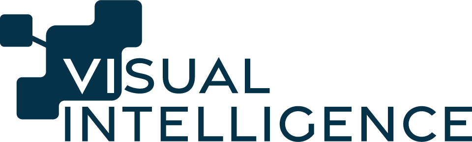
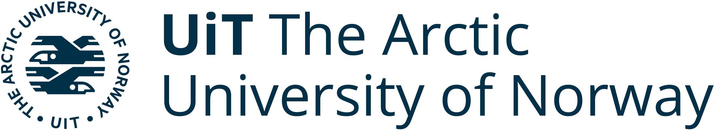
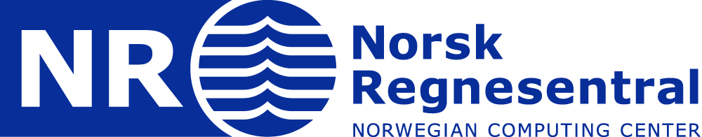
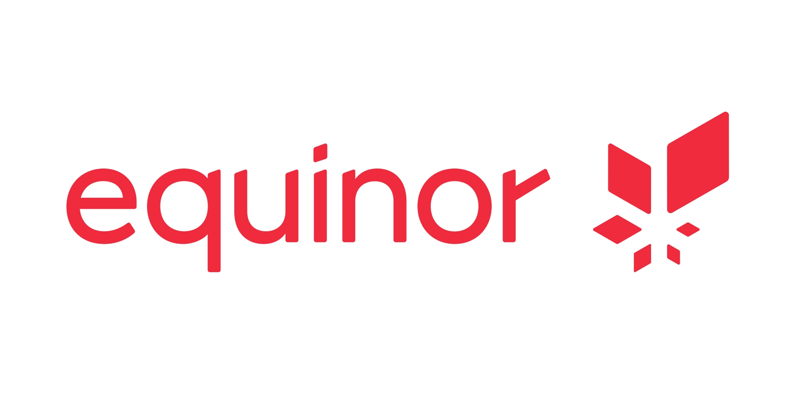
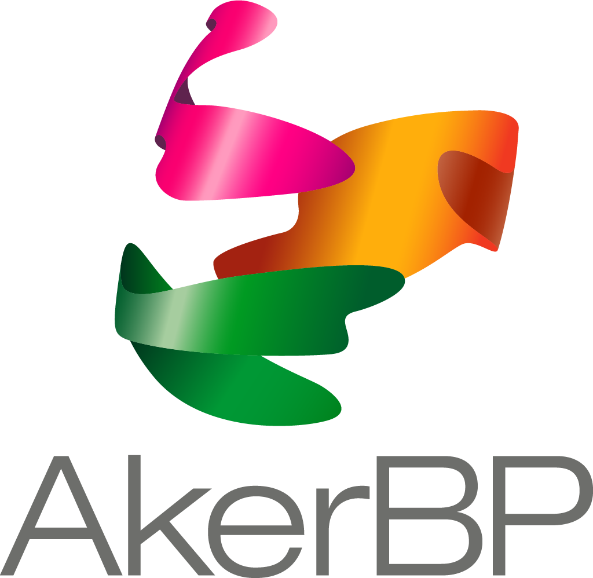
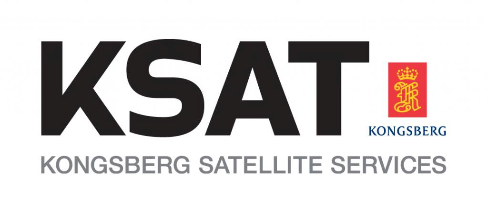
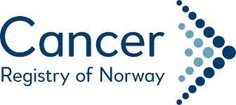
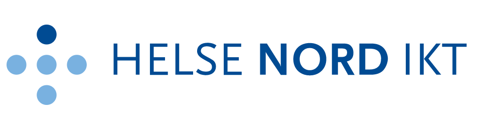
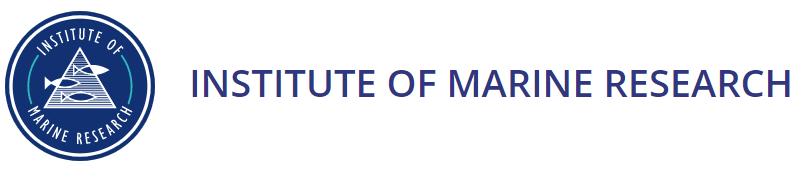

  

<h3 align="center">Norwegian Centre for Research-based Innovation (SFI)</h3>

Funded by the Research Council of Norway &nbsp;

  
  
  
  

---

## 🔬 About

**Visual Intelligence** is a Centre for Research-based Innovation (SFI), funded by the [Research Council of Norway](https://www.forskningsradet.no/) and consortium partners.

We develop novel **deep learning-based solutions** for complex image analysis — addressing innovation needs shared across corporate and public partners, and beyond. Our goal: make visual AI more capable, trustworthy, and explainable.

---

## 🎯 Mission & Vision

> *"Visual Intelligence shall be the lead provider of cutting-edge solutions for complex image analysis by leveraging deep learning — across multiple business sectors that rely on visual data."*

---

## 🌈 Core Innovation Areas

- 🏥 **Medicine & Health** — AI-assisted diagnostics, medical imaging, cancer detection
- 🌊 **Marine Science** — Underwater vision, species recognition, ocean monitoring
- ⚡ **Energy & Industry** — Remote inspection, infrastructure monitoring, industrial vision
- 🛰️ **Earth Observation** — Satellite imagery analysis, environmental monitoring

---

## 🧠 Key Research Challenges

- 📉 **Limited Training Data** — Building robust models when labelled examples are scarce
- 🔗 **Context & Dependencies** — Exploiting spatial, temporal, and semantic structure
- 📊 **Uncertainty Quantification** — Knowing when — and how much — a model doesn't know
- 💡 **Explainability & Reliability** — Interpretable and trustworthy deep learning in practice

---

## 🏛️ Research Partners

  
  &nbsp;&nbsp;&nbsp;
  
  &nbsp;&nbsp;&nbsp;
  

---

## 🤝 Consortium Partners

  
  &nbsp;&nbsp;&nbsp;
  
  &nbsp;&nbsp;&nbsp;
  
  &nbsp;&nbsp;&nbsp;
  

  
  &nbsp;&nbsp;&nbsp;
  
  &nbsp;&nbsp;&nbsp;
  
  &nbsp;&nbsp;&nbsp;
  

---

## 📅 Community & Events

- **VI Days 2026** — annual gathering for partners and researchers
- **Northern Lights Deep Learning Conference** — flagship regional DL conference, every January in Tromsø, Norway
- Seminars and workshops throughout the year

Subscribe to the [newsletter](https://www.visual-intelligence.no) to stay updated.

---

## 🚀 Getting Involved

Whether you are a **researcher**, **student**, **industry partner**, or **curious practitioner** — you are welcome here.

Reach out via the [Visual Intelligence website](https://www.visual-intelligence.no/about) to explore:
- 🔬 Research collaborations
- 🎓 Open positions and PhD opportunities
- 📆 Upcoming events and workshops

---

  Visual Intelligence is funded by the Research Council of Norway and consortium partners — project #309439 · 2020–2026

